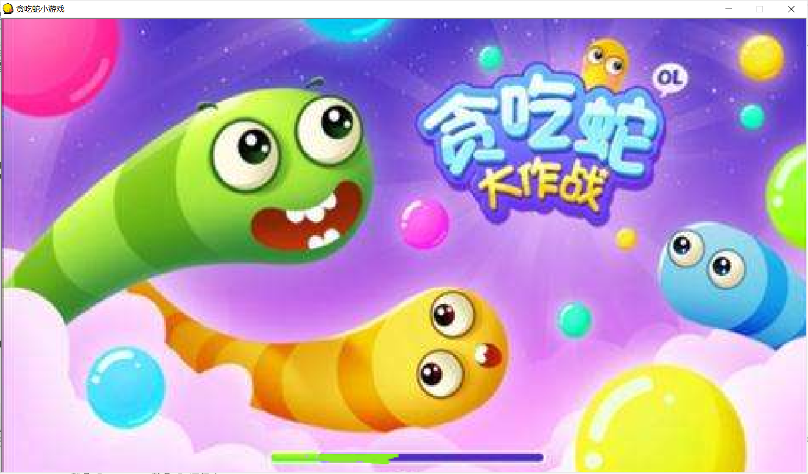

# 贪吃蛇合成数字小游戏

## 简介

这是我MFC的课程设计,  属于益智类游戏,  需要较强较迅速的计算机能力, 特别是临近答案的时候,  需要想到一套合成答案的数字组合.  里面的人机蛇使用的算法是深度优先选择算法,   对所有答案进行遍历, 找到一个最佳组合, 然后选择最近的一个数字进行移动.  它支持人机对战 以及 双人对战,  原本还有QT版本的可以网络对战, 但是我以前不会用git,没有存放在GitHub, 现在 已经删掉找不到了.

## 使用

### 直接启动

点击项目里面的snake.exe 直接运行,  这是我编译好了的程序, 由于使用了静态MFC库, 所以可以直接运行

### 编译运行

如果你对项目感兴趣, 想自己diy,加些功能啊, 或者借鉴,  那就需要使用visual c++6.0  打开运行 (我其实也不愿使用vc6.0, 奈何老师要求, 我原先都已经用vs2019写了大部分了,又被迫改过来)

## 人机算法介绍

```cpp
void dfsfindway(int p,vector<int>& temp,vector<int>& ans,int& result,int tempresult)
	{
       if(p>=Allfood.size())  // 如果遍历完食物, 选出了一个组合
	   {
          if(abs(answer-tempresult)<abs(answer-result))  //这个组合如果离答案比以前组合近, 就选择这个组合
		  {
			  ans=temp;
			  result=tempresult;
		  }
		  return;
       }
	   dfsfindway(p+1,temp,ans,result,tempresult); // 不选择当前数字,继续往下选

	   temp.push_back(p);  // 选择当前数字
	   dfsfindway(p+1,temp,ans,result,tempresult+Allfood[p]->nums); // 继续往下选
	   temp.pop_back(); 
       
	}

```

## 展示

### 加载界面



### 游戏开始界面


> 鼠标右键可以更改背景图片